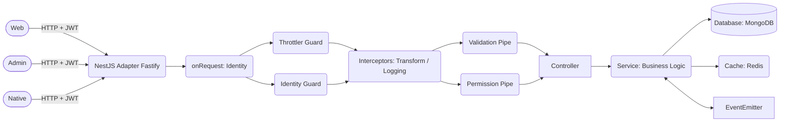
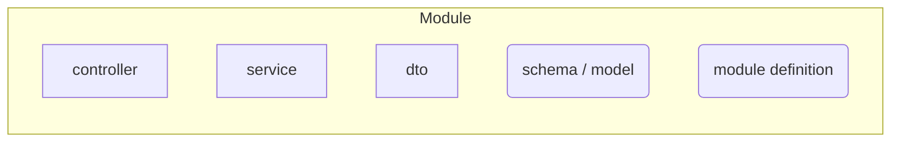
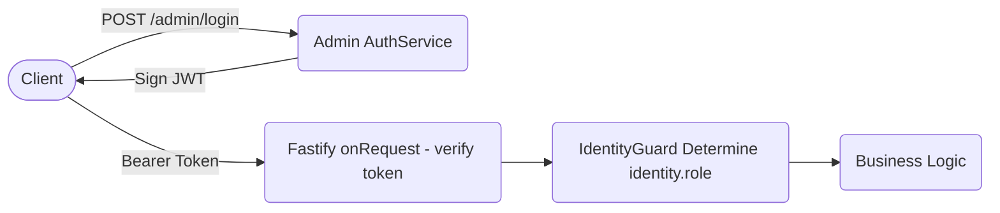

# NodePress Core Architecture Document (v7)

[English](./ARCHITECTURE.md) | [简体中文](./ARCHITECTURE.zh-CN.md)

NodePress is a blog CMS backend built on NestJS, designed with state-of-the-art engineering practices to provide unified data and business logic support for multi-platform applications.

This document aims to help developers understand the design philosophy, tech stack implementation, and data flow mechanisms of **NodePress**.

---

## 1. Tech Stack Snapshot

- **Core Framework**: [NestJS](https://nestjs.com/) (based on the high-performance [Fastify](https://www.fastify.io/) runtime)
- **Language & Tools**: TypeScript + pnpm
- **Database**: [MongoDB](https://www.mongodb.com/) (using [Mongoose](https://mongoosejs.com/) for ODM)
- **Caching Layer**: [Redis](https://redis.io/) (via `node-redis`)
- **Auth / Security**: JWT, Passport (Google / GitHub OAuth), bcrypt
- **Events & Scheduling**: `@nestjs/event-emitter` (Event Bus), `@nestjs/schedule` (Task Scheduling)
- **AI Capabilities**: OpenAI / Google Gemini / Cloudflare AI Gateway integration

## 2. Architecture Evolution & Design

NodePress follows the design principles of high cohesion, low coupling, modularity, and high extensibility.

### 2.1 Event-Driven Architecture

The system extensively utilizes `EventEmitter2` to decouple side-effect logic from the main request flow.

**General Workflow:**

1. **Main Business Flow**: The Service executes core database write operations (e.g., publishing an article, submitting a comment).
2. **Event Dispatching**: The Service proactively dispatches an event (e.g., `comment.created`).
3. **Asynchronous Response**: Multiple independent Listeners execute side-effects in parallel, including generating AI comment replies, triggering email notifications, and pushing Webhook data.

This design ensures that Controllers and Services remain pure, side-effect logic is pluggable, circular dependencies are eliminated, and new capabilities (especially AI scenarios) are easy to extend.

### 2.2 AI-Native Integration

The AI Module serves as an integral part of the core pipeline. Currently, it handles: article summary generation, article reviews, and intelligent comment replies.

Invocation is encapsulated within the [AI Module](./src/modules/ai) (using Cloudflare AI Gateway to bridge to external LLM services). Business modules are only responsible for triggering events or calling abstract services, remaining agnostic of specific LLM implementations.

### 2.3 Global Sharing & Dependency Management

Infrastructure support modules ([`DatabaseModule`](./src/core/database), [`CacheModule`](./src/core/cache), [`AuthModule`](./src/core/auth), [`HelperModule`](./src/core/helper)) are designed as global shared modules. Business modules can inject their services without explicit imports. Communication between business modules relies strictly on the event bus, preventing circular dependencies.

## 3. Request Lifecycle & API Standards

### 3.1 Request Lifecycle

HTTP requests enter the system following a strict NestJS execution order.

#### Lifecycle Diagram



#### Lifecycle Steps

1. **Request**
   - Within the Fastify [`onRequest`](./src/main.ts) hook, the system immediately parses the user's identity (Admin / User / Guest).
   - The Identity is attached to the request context for downstream consumption.

2. **Middleware**
   - Empty in this application.

3. **Guards**
   - `ThrottlerGuard`: Global and local rate limiting to prevent API abuse.
   - `IdentityGuard`: Intercepts and validates the requested identity.

4. **Pipes**
   - `ValidationPipe`: Strictly validates the input payload based on DTOs and `class-validator`.
   - `PermissionPipe`: Fine-grained validation for field-level read permissions (e.g., preventing guests from querying sensitive fields).

5. **Controller**
   - Route dispatching.

6. **Service**
   - Core business logic execution.

7. **Interceptor**
   - `LoggingInterceptor`: Supplements global logging.
   - `TransformInterceptor`: Standardizes the response structure.

8. **Filter (Exception Filter)**
   - `ExceptionFilter` catches unhandled exceptions and converts them into standardized error responses.

### 3.2 HTTP Status Code Standards

| Status Code | Semantics          | Context                                        |
| ----------- | ------------------ | ---------------------------------------------- |
| **200**     | OK                 | Standard successful request.                   |
| **201**     | Created            | Resource created successfully.                 |
| **400**     | Bad Request        | Validation failed or business logic rejection. |
| **401**     | Unauthorized       | Authentication failed or token expired.        |
| **403**     | Forbidden          | Insufficient permissions.                      |
| **404**     | Not Found          | Resource does not exist.                       |
| **405**     | Method Not Allowed | HTTP method not permitted.                     |
| **500**     | Internal Error     | Unexpected server-side failure.                |

### 3.3 Unified Response Schema

All API responses are formatted by [`TransformInterceptor`](./src/interceptors/transform.interceptor.ts), with the structure defined in [`response.interface.ts`](/src/interfaces/response.interface.ts).

```json
{
  "status": "success",
  "message": "Operation successful",
  "result": { ... } // Entity object, or collection with pagination and data
}

```

- **`status`**: Indicates request success (`success` | `error`).
- **`message`**: Human-readable feedback injected via the [`SuccessResponse`](./src/decorators/success-response.decorator.ts) decorator or interceptor.
- **`result`**: Business data. For lists, it contains `data` and `pagination`.
- **`error`**: Present only when `status` is `error`, typically providing a brief description of the failure.

## 4. Data Models & Storage Strategy

### 4.1 Dual-ID System

NodePress employs a dual-ID architecture:

- **`_id`**: Native MongoDB `ObjectId`, used for high-performance internal indexing and reference associations.
- **`id`**: Auto-incrementing numeric ID (MySQL style). Managed automatically via the [`@typegoose/auto-increment`](<%5Bhttps://github.com/typegoose/auto-increment%5D(https://github.com/typegoose/auto-increment)>) plugin, exposed to the frontend for better URL semantics and SEO.
- **Semantic Relationship IDs**: Such as `parent_id`, `target_id`, `user_id`, etc. These follow a full semantic naming convention (e.g., `user_id` instead of `uid`).

### 4.2 Extensibility (Extras Field)

Inspired by the WordPress [Custom Fields](https://wordpress.org/documentation/article/assign-custom-fields/) concept, core models like `Article`, `Comment`, and `Tag` include [`extras`](./src/models/key-value.model.ts) (a flexible array of key-value pairs).

This allows the system to attach third-party metadata (e.g., `disqus-author-id`) or AI-generated metadata at any time without altering the underlying Schema.

### 4.3 Data Sources

Data in NodePress originates from:

- **Database**: Physical storage fields.
- **Virtuals**: Derived data fields implemented via [Mongoose Virtuals](https://mongoosejs.com/docs/tutorials/virtuals.html).
- **Third-party Data**: Aggregated data from integrations like Google Analytics.

## 5. Module Categorization

### 5.1 Core Modules

Infrastructure-level modules shared by all business modules.

#### [DatabaseModule](./src/core/database)

- Initializes MongoDB connections.
- Unified connection management.
- Exception catching and logging.

#### [CacheModule](./src/core/cache)

- Encapsulates the Redis client.
- Provides a unified caching API.
- Manages TTL and namespaces.

#### [AuthModule](./src/core/auth)

- JWT issuance and verification.
- Token parsing.
- Identity injection into the request context.

#### [HelperModule](./src/core/helper)

- [IP Geolocation](./src/core/helper/helper.service.ip.ts)
- [Email Service](./src/core/helper/helper.service.email.ts)
- [SEO Submission](./src/core/helper/helper.service.seo.ts)
- [S3 Storage](./src/core/helper/helper.service.s3.ts)
- [Google Credentials Management](./src/core/helper/helper.service.google.ts)
- [Global Numeric Counter](./src/core/helper/helper.service.counter.ts)

### 5.2 Business Modules

Each business module follows this structure:



#### Content Modules

- [Announcement](./src/modules/announcement)
- [Article](./src/modules/article)
- [Category](./src/modules/category)
- [Tag](./src/modules/tag)
- [Comment](./src/modules/comment)

#### User & Authentication Modules

- [Auth](./src/core/auth): Global JWT issuance and verification service.
- [Admin](./src/modules/admin): Administrator identity validation and profile management.
- [User](./src/modules/user): Client-side user CRUD.
- [Account](./src/modules/account): Dedicated user-facing module supporting OAuth2 login (Google / GitHub) and automatic account linking.

#### Intelligence & Integration Modules

- [AI](./src/modules/ai): Integrated AI services via Cloudflare AI Gateway, encapsulating article summarization, automated comment moderation, etc.
- [Webhook](./src/modules/webhook): Communication with external systems.

#### Infrastructure Support Modules

- [Archive](./src/modules/archive): Homepage and archive data cache optimization and aggregated scheduling.
- [System](./src/modules/system): Utilities such as scheduled database backups, site statistics, and cloud storage management.

## 6. Identity & Authentication

In NodePress, Admin and User are distinct user types with non-overlapping permission systems, making a traditional RBAC model inapplicable.

Instead, the [Identity](./src/constants/identity.constant.ts) concept is abstracted to represent the requester's identity type:

- **Admin**: A single account entity with no explicit username, relying on password authentication (stored as a `bcrypt` hash). Admins possess root privileges and can access all NodePress capabilities.
- **User**: Password-less, requiring OAuth login. JWTs are issued via the global `AuthService` with a longer expiration (default is one week).
- **Guest**: Not a physical business user type, but a technical abstraction for unauthenticated requests, which carry no default permissions.

| Identity  | Permissions                                              |
| --------- | -------------------------------------------------------- |
| **Guest** | Read-only (limited fields) + public comments / reactions |
| **User**  | Guest capabilities + personal account data management    |
| **Admin** | All write operations                                     |

NodePress utilizes JWT (JSON Web Token) for stateless authentication, issued via the global `AuthModule`'s `AuthService`.

#### Admin Authentication Mechanism

The Admin authentication flow is as follows:

1. Admin submits credentials via `POST /admin/login`.
2. `AuthModule` validates the password and issues a JWT (containing claims like `role`, `iat`, `exp`), typically with a short lifespan.
3. The client includes the Bearer Token in the `Authorization` header for subsequent requests.
4. At the entry point of a request, the Fastify `onRequest` hook parses the [Identity](./src/constants/identity.constant.ts) (Admin / User / Guest) directly from the token and attaches it to the request context.
5. [`IdentityGuard`](./src/guards/identity.guard.ts) reads the attached identity information to match it against requirements defined by the [`OnlyIdentity`](./src/decorators/only-identity.decorator.ts) decorator. If they do not match, the request is intercepted. **Note: `IdentityGuard` does not handle "token parsing"; this is completed during `onRequest`. The guard's core responsibility is strictly "matching the identity".**

**Flow:**



#### User Authentication Mechanism

The User authentication mechanism differs slightly. Being password-less, users must first authorize via third-party OAuth. The callback reaches the [`/account/auth`](src/modules/account/auth) endpoint, which issues a token and notifies the frontend via `PostMessage`. Subsequent identity validation follows the same process as Admin.

#### Guest Permission Control

Global parameter validation is handled by the global [`ValidationPipe`](./src/main.ts); malformed requests return a 400 error.

If a user attempts to specify fields they are not authorized to access (e.g., a non-admin attempting to query deleted comments via `/articles?status=-1`), the request is treated as unauthorized and returns a 403 error.

This is achieved through the synergy between [`WithGuestPermission`](./src/decorators/guest-permission.decorator.ts) and [`PermissionPipe`](./src/pipes/permission.pipe.ts).

## 7. Security & Compliance

### 7.1 API & Data Security

- All sensitive configurations (JWT Secret, Database URI) are **managed via environment variables**.
- **Credential Protection**: Admin passwords are stored as `bcrypt` hashes.
- **Permission Interception**: Non-public write operations require JWT validation, enforced by `IdentityGuard`.
- **Abuse Prevention**: Global rate limiting (Rate Limiting) is enabled for all endpoints.
- **Signature Validation**: Outbound Webhook payloads are digitally signed using HMAC-SHA256 to ensure data integrity.
- **CORS / Origin Control**: A strict CORS whitelist is maintained, relying on Origin checks and modern browser security policies.

### 7.2 OAuth Compliance

- To maintain compatibility with Google's strict OAuth requirements and browser Same-Origin policies, the system uses a **PostMessage Bridge** for popup callbacks.
- Token data is transmitted using `type="application/json"`, and external static scripts are used to comply with CSP `unsafe-inline` restrictions.
- For OAuth callback routes, `Cross-Origin-Opener-Policy` is dynamically set to `unsafe-none` to ensure seamless multi-window communication.

## 8. CI/CD & Testing

**Testing Strategy:**

- **Unit Test**: Uses Jest to test Services and Helpers in isolation.
- **Integration Test**: Uses the NestJS Testing module to verify inter-module collaboration.

**Automation Workflow**: Powered by GitHub Actions for automated building, testing, and hot deployment to the server upon code submission.

## 9. Third-party Integrations

- **[Akismet](https://akismet.com/) Anti-Spam**: Integrated for basic spam detection.
- **[Google Indexing API](https://developers.google.com/search/apis/indexing-api/v3/quickstart)** (Accelerated indexing)
- **[Google Analytics API](https://developers.google.com/analytics/devguides/reporting/data/v1)** (Site traffic aggregation)
