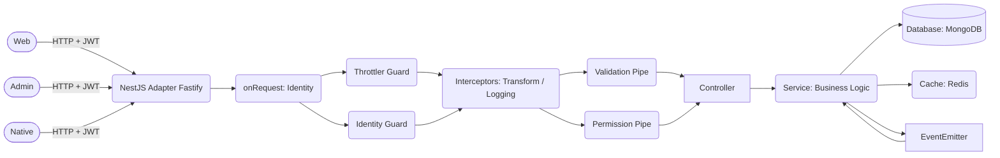
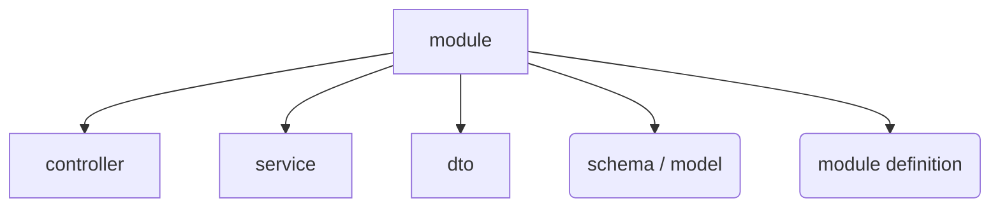
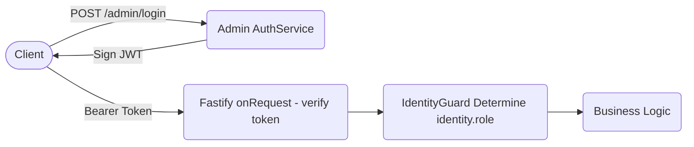

# NodePress 核心架构文档（v7）

[English](./ARCHITECTURE.md) | [简体中文](./ARCHITECTURE.zh-CN.md)

NodePress 是一个基于 NestJS 且追求极致工程实践的博客 CMS 后端，为多端应用提供统一的数据和业务逻辑支撑。

本文档旨在帮助开发者理解 **NodePress** 的设计哲学、技术栈实现以及数据流转机制。

---

## 1. 技术栈快照

- **核心框架**：[NestJS](https://nestjs.com/)（基于高性能的 [Fastify](https://www.fastify.io/) 运行时）
- **语言工具**：TypeScript + pnpm
- **数据库**：[MongoDB](https://www.mongodb.com/)（通过 [Mongoose](https://mongoosejs.com/) 进行 ODM 操作）
- **缓存层**：[Redis](https://redis.io/)（通过 `node-redis`）
- **认证 / 鉴权**：JWT、Passport（Google / GitHub OAuth）、bcrypt
- **事件与调度**：`@nestjs/event-emitter`（事件总线）、`@nestjs/schedule`（定时任务）
- **AI 能力**：OpenAI / Google Gemini / Cloudflare AI Gateway 集成

## 2. 核心架构演进设计

NodePress 的设计原则为：高内聚、低耦合、模块化、高扩展性。

### 2.1 事件驱动架构

系统广泛使用 `EventEmitter2` 将副作用逻辑与主业务流程解耦。

整体流程：

1. **主业务流**：Service 执行核心数据库写操作（如发布文章、提交评论）。
2. **事件分发**：Service 主动派发事件（如 `comment.created`）。
3. **异步响应**：多个独立的 Listener 并行执行副作用，包括生成 AI 评论回复、邮件通知触发，以及 Webhook 数据推送。

这种设计确保了：Controller / Service 保持纯净、副作用逻辑可插拔、无循环依赖、易于扩展新能力（尤其 AI 场景）。

### 2.2 AI-Native 融合

AI Module 作为核心 Pipeline 的一部分。目前主要负责：文章摘要生成、文章点评生成、评论智能回复。

其调用方式统一封装在 [AI 模块](./src/modules/ai) 内部（通过 Cloudflare AI Gateway 间接调用外部大模型服务），业务模块只负责触发事件或调用抽象服务，不直接依赖具体 LLM 实现。

### 2.3 全局共享与依赖管理

核心支撑模块（[`DatabaseModule`](./src/core/database)、[`CacheModule`](./src/core/cache)、[`AuthModule`](./src/core/auth)、[`HelperModule`](./src/core/helper)）被设计为全局共享模块。业务模块无需显式导入即可注入底层 Service。各业务模块之间严格依靠事件总线通信，没有循环依赖。

## 3. 请求生命周期与 API 规范

### 3.1 请求生命周期

HTTP 请求进入系统后，严格遵循 NestJS 的执行顺序。

#### 生命周期示意图



#### 生命周期步骤

1. **Request**
   - 在 Fastify 的 [`onRequest`](./src/main.ts) Hook 中，系统直接解析当前用户身份（Admin / User / Guest）。
   - 将 Identity 挂载到 request 上下文供后续流程消费。

2. **Middleware（中间件）**
   - 在此应用中为空。

3. **Guards（守卫）**
   - `ThrottlerGuard`：全局与局部限流，防止接口被暴力滥用。
   - `IdentityGuard`：统一拦截并验证请求身份。

4. **Pipes（管道）**
   - `ValidationPipe`：基于 DTO 与 `class-validator` 严格校验输入。
   - `PermissionPipe`：细粒度校验字段级读取权限（防止游客查询敏感字段）。

5. **Controller**
   - 路由分发。

6. **Service**
   - 执行核心业务逻辑。

7. **Interceptor（拦截器）**
   - `LoggingInterceptor`：补充全局日志。
   - `TransformInterceptor`：统一格式化响应结构。

8. **Filter（异常过滤器）**
   - `ExceptionFilter` 捕获未被处理的异常，并转换为标准错误响应。

### 3.2 HTTP 状态码规范

| 状态码  | 语义               | 场景                      |
| ------- | ------------------ | ------------------------- |
| **200** | OK                 | 标准成功请求              |
| **201** | Created            | 资源创建成功              |
| **400** | Bad Request        | 参数校验失败或业务拒绝    |
| **401** | Unauthorized       | 身份验证失败或 Token 失效 |
| **403** | Forbidden          | 权限不足                  |
| **404** | Not Found          | 资源不存在                |
| **405** | Method Not Allowed | 请求方法不允许            |
| **500** | Internal Error     | 服务器内部异常            |

### 3.3 统一响应结构

所有 API 响应均经过 [`TransformInterceptor`](./src/interceptors/transform.interceptor.ts) 格式化，其结构定义于 [`response.interface.ts`](./src/interfaces/response.interface.ts)。

```json
{
  "status": "success",
  "message": "操作成功",
  "result": { ... } // 实体对象，或包含 pagination 与 data 的列表集合
}
```

- **`status`**：标识请求成败（`success` | `error`）。
- **`message`**：由 [`SuccessResponse`](./src/decorators/success-response.decorator.ts) 装饰器或拦截器注入的人类可读提示。
- **`result`**：业务数据。若为列表，则包含 `data` 和 `pagination`。
- **`error`**：当 `status` 为 `error` 时必定存在，通常是对错误的简单描述。

## 4. 数据模型与存储策略

### 4.1 核心标识符

NodePress 采用双 ID 体系：

- **`_id`**：MongoDB 原生 `ObjectId`，负责数据库内部的高效索引和引用关联。
- **`id`**：自增数字 ID（MySQL 风格）。通过 [`@typegoose/auto-increment`](https://github.com/typegoose/auto-increment) 插件自动维护，暴露给前端以提升 URL 语义化和 SEO 表现。
- **语义化关系 ID**：如 `parent_id`、`target_id`、`user_id`... 等，统一采用完整语义化命名（例如 `user_id` 而非 `uid`）。

### 4.2 扩展性设计

借鉴 WordPress 的 [Custom Fields](https://wordpress.org/documentation/article/assign-custom-fields/) 理念，`Article`、`Comment`、`Tag` 等核心模型引入了 [`extras`](./src/models/key-value.model.ts)（灵活的键值对数组）。

这使得系统可以在不修改底层 Schema 的前提下，随时挂载第三方同步标识（如 `disqus-author-id`）、AI 生成的元数据等信息。

### 4.3 数据的几种来源

NodePress 中的数据来源包括：

- **Database**：数据库物理存储字段。
- **Virtuals**：通过 [Mongoose Virtuals](https://mongoosejs.com/docs/tutorials/virtuals.html) 衍生的数据字段。
- **第三方数据**：如 Google Analytics 聚合数据。

## 5. 业务模块的划分（Modules）

### 5.1 核心模块

核心模块为基础设施层，被所有业务模块共享。

#### [DatabaseModule](./src/core/database)（数据库）

- 初始化 MongoDB 连接
- 统一连接管理
- 异常捕获与日志处理

#### [CacheModule](./src/core/cache)（缓存）

- 封装 Redis 客户端
- 提供统一缓存 API
- 管理缓存 TTL 与命名空间

#### [AuthModule](./src/core/auth)（鉴权）

- JWT 签发与验证
- Token 解析
- 身份注入 request context

#### [HelperModule](./src/core/helper)（工具服务）

- [IP 地理位置解析](./src/core/helper/helper.service.ip.ts)
- [邮件发送](./src/core/helper/helper.service.email.ts)
- [SEO 提交](./src/core/helper/helper.service.seo.ts)
- [S3 存储](./src/core/helper/helper.service.s3.ts)
- [Google 凭据管理](./src/core/helper/helper.service.google.ts)
- [全局通用计数器](./src/core/helper/helper.service.counter.ts)

### 5.2 业务模块

每个业务模块遵循此结构：



#### 主体内容

- [Announcement](./src/modules/announcement)：公告
- [Article](./src/modules/article)：文章
- [Category](./src/modules/category)：分类
- [Tag](./src/modules/tag)：标签
- [Comment](./src/modules/comment)：评论

#### 用户与鉴权模块

- [Auth](./src/core/auth)：系统公用的 JWT 签发与校验服务。
- [Admin](./src/modules/admin)：管理员身份校验与资料管理。
- [User](./src/modules/user)：前台用户体系的 CRUD。
- [Account](./src/modules/account)：专为前台用户服务的模块，支持 OAuth2 登录（Google / GitHub），自动与本地用户体系关联。

#### 智能与集成模块

- [AI](./src/modules/ai)：集成了基于 Cloudflare AI Gateway 的有限的 AI 服务，封装文章摘要生成、评论自动审核等智能逻辑。
- [Webhook](./src/modules/webhook)：与外部系统通信。

#### 底层支撑模块

- [Archive](./src/modules/archive)：首页与归档数据缓存优化，聚合缓存调度。
- [System](./src/modules/system)：一些工具类，如数据库定时备份、站点数据统计、云存储文件管理。

## 6. 身份与鉴权（Identity & Authentication）

在 NodePress 中，Admin 与 User 是两种完全不同的用户类型，不共享权限体系，不适用于 RBAC 模型。

因此抽象出 [Identity](./src/constants/identity.constant.ts) 概念，表示当前请求者身份类型：

- Admin 的特征是：**单账号实体、无用户名、仅密码认证，密码通过 `bcrypt` 强哈希存储，具有最高权限，可以调用 NodePress 的一切能力。**
- User 的特征是：**无密码、必须使用 OAuth 登录，JWT 同样通过全局的 AuthService 签发，过期时间较长（默认值是一星期）。**
- Guest 并非实体业务中的一种用户类型，而是为了方便技术上的标准实现抽离出的一种抽象，默认不附加任何权限的请求都属于 Guest。

| 身份      | 权限                                  |
| --------- | ------------------------------------- |
| **Guest** | 只读（有限字段）+ 公共评论 / 公共踩赞 |
| **User**  | Guest 能力 + 个人账户数据管理         |
| **Admin** | 所有写操作                            |

NodePress 采用 JWT（JSON Web Token）进行无状态身份认证。JWT 通过全局 Auth 模块下的 AuthService 签发。

#### Admin 管理员认证机制

Admin 管理员的认证流程如下：

1. 管理员通过 POST /admin/login 提交凭据。
2. AuthModule 验证密码，签发 JWT（包含 role、iat、exp 等 Claims），默认生存时间较短（一小时或几小时）。
3. 客户端在后续请求的 Authorization Header 中携带 Bearer Token。
4. 在请求的第一个节点：Fastify 的 `onRequest` Hook 中，会直接根据请求头中的 Token 解析当前用户身份 `Identity`（Admin / User / Guest），并挂载到 request 上下文供后续流程消费。
5. [`IdentityGuard`](./src/guards/identity.guard.ts) 将会读取 request 上挂载的当前用户身份信息，用于和 [`OnlyIdentity`](./src/decorators/only-identity.decorator.ts) 装饰器标注的身份匹配，如果不匹配则会直接拦截。**注意在这里 `IdentityGuard` 没有做「识别身份」和「解析 Token」这些事，这些早就在 onRequest 时就完成了，在这里 OnlyIdentity 的核心职责仅为「判断身份是否匹配」。**

流程：



#### User 普通用户认证机制

普通用户的认证机制与管理员略有不同，因为是无密码设计，普通用户必须先通过第三方 OAuth 授权登录后，callback 到 [`/account/auth`](src/modules/account/auth) 相关接口，对应接口会签发 Token 并通过 PostMessage 通知前台接收 Token。

而后续的身份校验流程则与 Admin 无异。

#### Guest 访客用户的权限控制

全局的参数校验使用 Global [`ValidationPipe`](./src/main.ts) 来实现，当用户传递的参数格式不正确时会直接返回 400 错误。

但如果用户传递的是自己无权指定的字段，比如：非管理员用户永远无法访问已删除的评论数据，但若在请求参数中指定 `/articles?status=-1`，这种就属于越权请求，需要返回 403 错误。

这里的实现得益于：[`WithGuestPermission`](./src/decorators/guest-permission.decorator.ts)、[`PermissionPipe`](./src/pipes/permission.pipe.ts) 这两套机制的互相配合。

## 7. 安全与合规设计（Security）

### 7.1 接口与数据安全

- 所有敏感配置（JWT Secret、数据库 URI）均 **由环境变量管理**。
- **凭据保护**：管理员密码使用 `bcrypt` 强哈希存储。
- **权限拦截**：所有需要身份认证的写操作接口强制 JWT 校验，由 `IdentityGuard` 统一判断和拦截。
- **防滥用**：接口全局启用限流机制（Rate Limiting）。
- **签名校验**：对外发送的 Webhook 负载均采用 HMAC-SHA256 进行数字签名，保障数据防篡改。
- **CORS / Origin 控制**：后端维持严格的 CORS 白名单，依靠 Origin 检查与现代浏览器策略。

### 7.2 OAuth 合规

- 为了兼容 Google 严格的 OAuth 机制和浏览器同源策略，系统通过 **PostMessage Bridge** 处理弹窗回调。
- 使用 `type="application/json"` 传输 Token 数据，配合外部静态脚本适配 CSP 的 `unsafe-inline` 限制。
- 针对 OAuth 回调路由，动态放宽 `Cross-Origin-Opener-Policy` 为 `unsafe-none`，确保多窗口顺畅通信。

## 8. 测试与持续部署（CI/CD）

**测试策略**：

- 单元测试（Unit Test）：采用 Jest 针对 Service 与 Helper 进行隔离测试。
- 集成测试（Integration Test）：利用 NestJS Testing 模块，验证模块间协作。

**自动化流**：依托 GitHub Actions，实现代码提交后的自动化构建、测试执行与服务器的热部署。

## 9. 第三方生态集成

- **[Akismet](https://akismet.com/) 反垃圾系统**：集成 Akismet 进行基础的 Spam 检测。
- [**Google Indexing API**](https://developers.google.com/search/apis/indexing-api/v3/quickstart)（自动加速收录）
- [**Google Analytics API**](https://developers.google.com/analytics/devguides/reporting/data/v1)（站点流量聚合）
